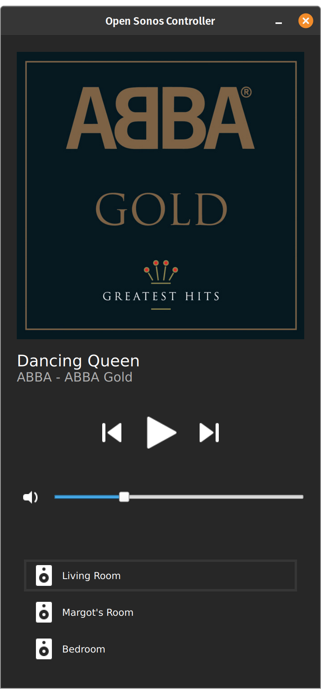

# Open Sonos Controller
This is meant to be the first hackable sonos controller. Based on ingenious NodeGUI. It is a native Linux app (other platforms soon to be coming), yet written in react. It offers snappy performance and great developer experience. 

## What is it?
OSC is not meant to replace sonos app or even spotify. It's just a remote to your sonos. Primarily focused on a severely underserved Linux community. 

## [linux appImage](https://github.com/tomasbulva/open-sonos-controller/releases)

## How does it look? 

## Features
- album cover image
- volume slider
- audio control (play, pause, previous and next track)
- room selector
- mute
- tv mode controls

## Todo
- groups
- favorites
- source selector

---

